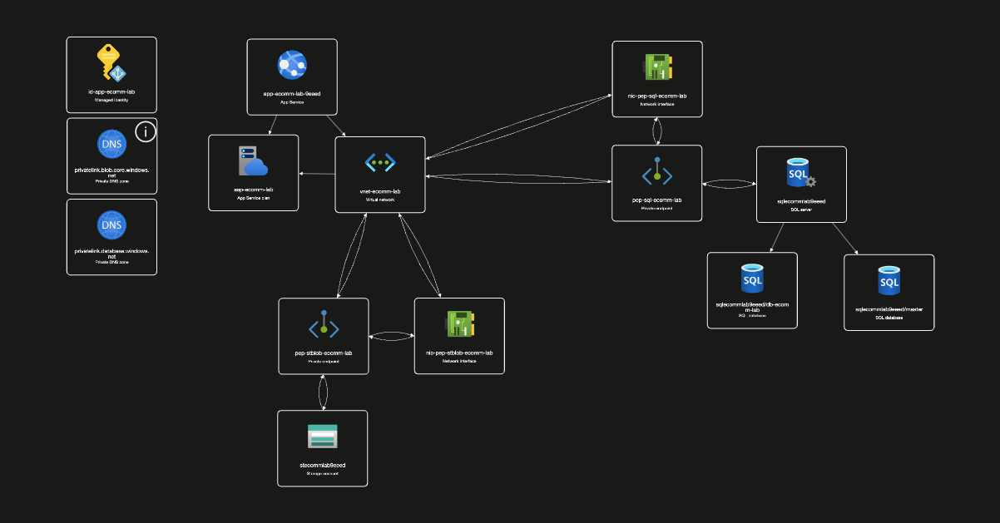
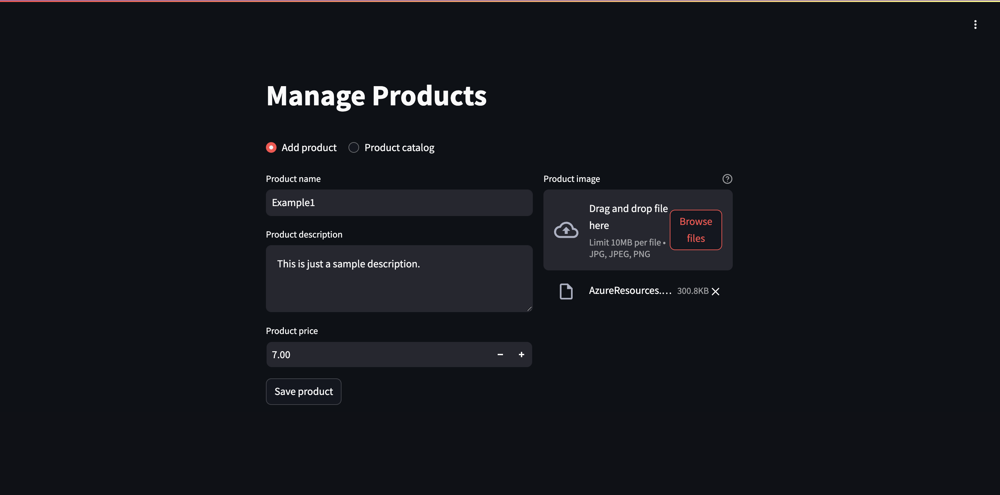
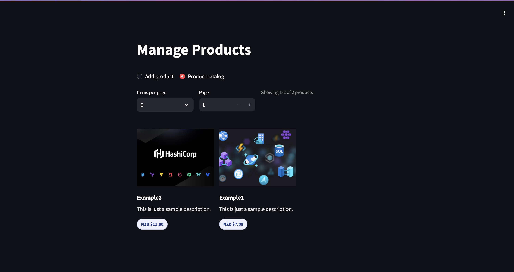

## Demo

This section gives a quick visual overview of the lab.

### Architecture (Resource Visualizer)

### Add Product

### Product Catalog

For a simple non-technical architecture explanation, see [README-architecture.md](README-architecture.md).

---

<!-- BEGIN_TF_DOCS -->

#### Requirements

| Name | Version |
|------|---------|
|  [terraform](#requirement\_terraform) | = 1.12.2 |
|  [archive](#requirement\_archive) | = 2.7.1 |
|  [azurerm](#requirement\_azurerm) | = 4.62.1 |
|  [random](#requirement\_random) | = 3.8.1 |

#### Providers

| Name | Version |
|------|---------|
|  [archive](#provider\_archive) | 2.7.1 |
|  [azurerm](#provider\_azurerm) | 4.62.1 |
|  [random](#provider\_random) | 3.8.1 |

#### Modules

No modules.

#### Resources

| Name | Type |
|------|------|
| [azurerm_linux_web_app.ecommerce](https://registry.terraform.io/providers/hashicorp/azurerm/4.62.1/docs/resources/linux_web_app) | resource |
| [azurerm_mssql_database.ecommerce](https://registry.terraform.io/providers/hashicorp/azurerm/4.62.1/docs/resources/mssql_database) | resource |
| [azurerm_mssql_server.ecommerce](https://registry.terraform.io/providers/hashicorp/azurerm/4.62.1/docs/resources/mssql_server) | resource |
| [azurerm_private_dns_zone.sql](https://registry.terraform.io/providers/hashicorp/azurerm/4.62.1/docs/resources/private_dns_zone) | resource |
| [azurerm_private_dns_zone.storage_blob](https://registry.terraform.io/providers/hashicorp/azurerm/4.62.1/docs/resources/private_dns_zone) | resource |
| [azurerm_private_dns_zone_virtual_network_link.sql](https://registry.terraform.io/providers/hashicorp/azurerm/4.62.1/docs/resources/private_dns_zone_virtual_network_link) | resource |
| [azurerm_private_dns_zone_virtual_network_link.storage_blob](https://registry.terraform.io/providers/hashicorp/azurerm/4.62.1/docs/resources/private_dns_zone_virtual_network_link) | resource |
| [azurerm_private_endpoint.sql](https://registry.terraform.io/providers/hashicorp/azurerm/4.62.1/docs/resources/private_endpoint) | resource |
| [azurerm_private_endpoint.storage_blob](https://registry.terraform.io/providers/hashicorp/azurerm/4.62.1/docs/resources/private_endpoint) | resource |
| [azurerm_resource_group.ecommerce](https://registry.terraform.io/providers/hashicorp/azurerm/4.62.1/docs/resources/resource_group) | resource |
| [azurerm_role_assignment.blob_data_contributor_web_app](https://registry.terraform.io/providers/hashicorp/azurerm/4.62.1/docs/resources/role_assignment) | resource |
| [azurerm_service_plan.ecommerce](https://registry.terraform.io/providers/hashicorp/azurerm/4.62.1/docs/resources/service_plan) | resource |
| [azurerm_storage_account.ecommerce](https://registry.terraform.io/providers/hashicorp/azurerm/4.62.1/docs/resources/storage_account) | resource |
| [azurerm_storage_container.ecommerce](https://registry.terraform.io/providers/hashicorp/azurerm/4.62.1/docs/resources/storage_container) | resource |
| [azurerm_subnet.app_integration](https://registry.terraform.io/providers/hashicorp/azurerm/4.62.1/docs/resources/subnet) | resource |
| [azurerm_subnet.private_endpoints](https://registry.terraform.io/providers/hashicorp/azurerm/4.62.1/docs/resources/subnet) | resource |
| [azurerm_user_assigned_identity.ecommerce_app](https://registry.terraform.io/providers/hashicorp/azurerm/4.62.1/docs/resources/user_assigned_identity) | resource |
| [azurerm_virtual_network.ecommerce](https://registry.terraform.io/providers/hashicorp/azurerm/4.62.1/docs/resources/virtual_network) | resource |
| [random_password.sql_admin](https://registry.terraform.io/providers/hashicorp/random/3.8.1/docs/resources/password) | resource |
| [archive_file.streamlit_app](https://registry.terraform.io/providers/hashicorp/archive/2.7.1/docs/data-sources/file) | data source |
| [azurerm_client_config.current](https://registry.terraform.io/providers/hashicorp/azurerm/4.62.1/docs/data-sources/client_config) | data source |

#### Inputs

| Name | Description | Type | Default | Required |
|------|-------------|------|---------|:--------:|
|  [app\_integration\_subnet\_cidr](#input\_app\_integration\_subnet\_cidr) | CIDR range for the delegated App Service VNet integration subnet. | `list(string)` | <pre>[   "10.30.1.0/24" ]</pre> | no |
|  [default\_location](#input\_default\_location) | Azure region where the resource group and regional services are created. | `string` | `"australiaeast"` | no |
|  [environment](#input\_environment) | Environment label used in resource names, for example lab, dev, or prod. | `string` | `"lab"` | no |
|  [prefix](#input\_prefix) | Short naming prefix used in resource names. | `string` | `"ecomm"` | no |
|  [private\_endpoints\_subnet\_cidr](#input\_private\_endpoints\_subnet\_cidr) | CIDR range for the subnet that hosts private endpoint network interfaces. | `list(string)` | <pre>[   "10.30.2.0/24" ]</pre> | no |
|  [sql\_aad\_admin\_login\_username](#input\_sql\_aad\_admin\_login\_username) | Optional Microsoft Entra SQL admin username; when null, the user-assigned identity name is used. | `string` | `null` | no |
|  [sql\_aad\_admin\_object\_id](#input\_sql\_aad\_admin\_object\_id) | Optional Microsoft Entra SQL admin object ID; when null, the user-assigned identity principal ID is used. | `string` | `null` | no |
|  [sql\_admin\_login](#input\_sql\_admin\_login) | Base SQL admin login. | `string` | `"sqladminuser"` | no |
|  [subscription\_id](#input\_subscription\_id) | Azure subscription ID used by the provider. | `string` | `""` | no |
|  [tags](#input\_tags) | Tag map applied to resources that support tags in this deployment. | `map(string)` | <pre>{   "deployed_by": "terraform",   "environment": "lab",   "project": "ecommerce" }</pre> | no |
|  [tenant\_id](#input\_tenant\_id) | Optional Microsoft Entra tenant ID for SQL admin setup; when null, the current authenticated tenant is used. | `string` | `null` | no |
|  [vnet\_address\_space](#input\_vnet\_address\_space) | Address space assigned to the shared virtual network. | `list(string)` | <pre>[   "10.30.0.0/16" ]</pre> | no |

#### Outputs

| Name | Description |
|------|-------------|
|  [web\_app\_url](#output\_web\_app\_url) | Public URL for the Streamlit app. |
<!-- END_TF_DOCS -->
